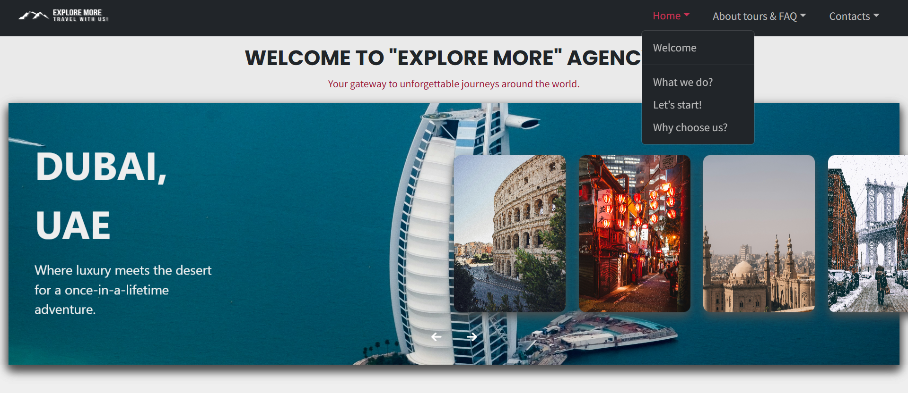
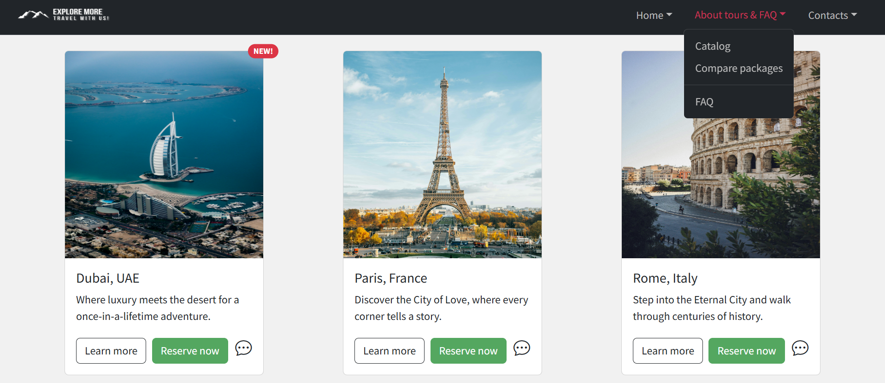
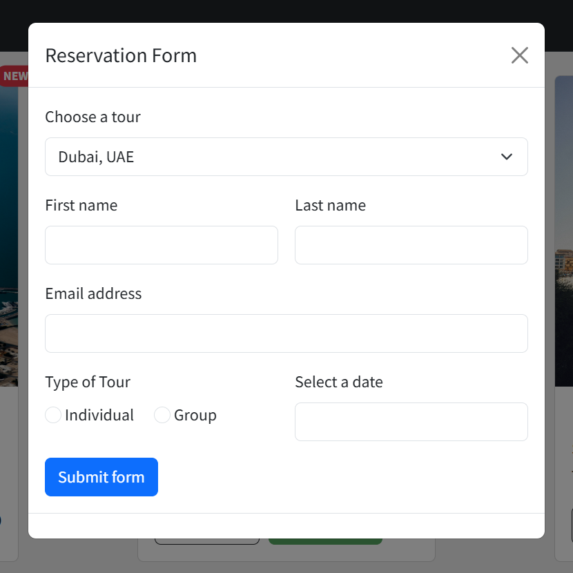
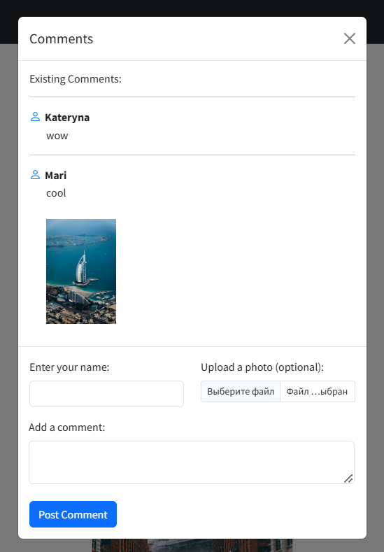
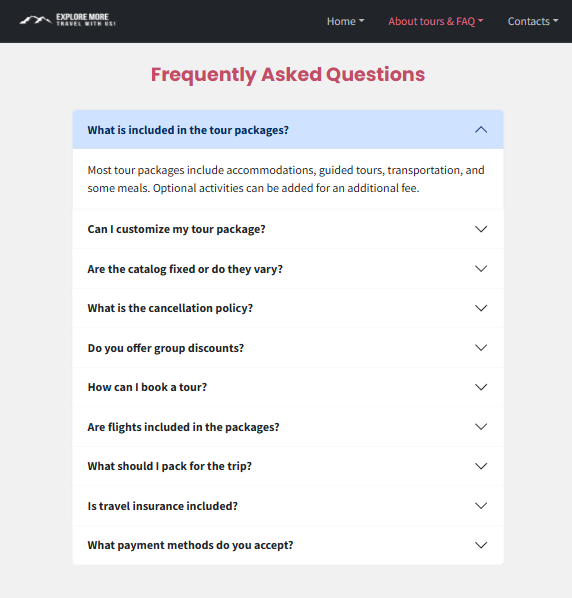
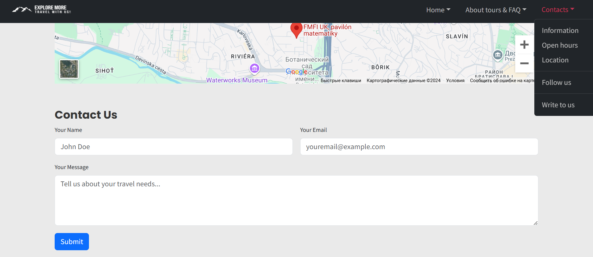

# Website for "Explore More" Agency

*This is the website of the company "Explore More"  consisting of 3 pages: Home, About tours & FAQ, Contacts. On the website the user will learn a detailed description of the tours, find the price for each of them, also can book this tour through the form, write a comment if he was impressed/disappointed with the tour, find answers to frequently asked questions and can also contact the company through the form or by phone/e-mail.*

## Pages

### Home

On this page there are photos of different tours and description of the company, so that the user can get acquainted with the company.

### About tours & FQA

Here the user reads detailed information about each of the tours, compare them, can reserve one of them for a certain date, share impressions about the tour and find answers to frequently asked questions.

### Contacts

On the Contacts page, the user will find the phone number, e-mail adress, physical address and all social media accounts of the company. The user can also ask a question using the Contact us form.

---

## Install

To run this project clone this repository to your local machine and open the ``home.html`` file in your browser.
